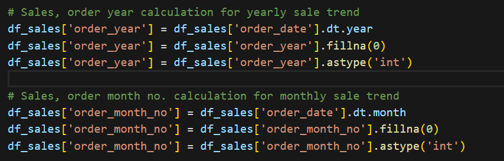
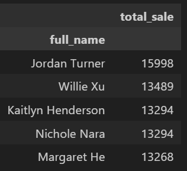
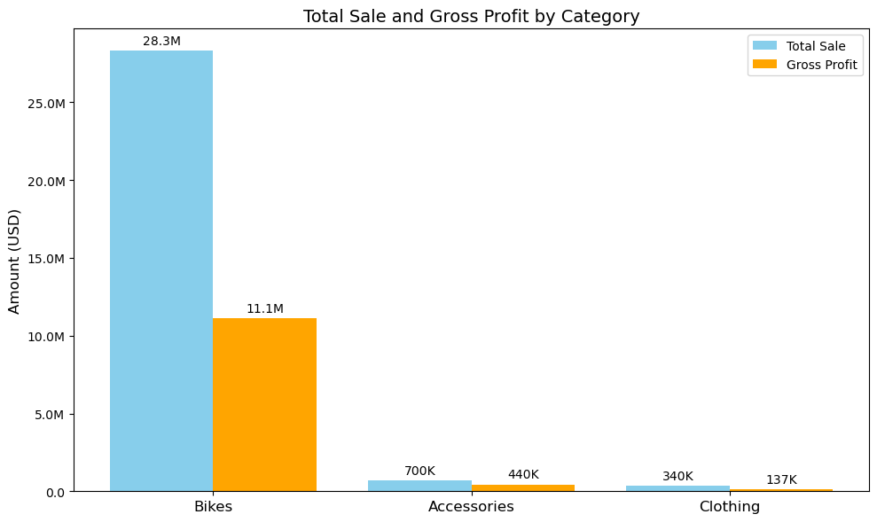
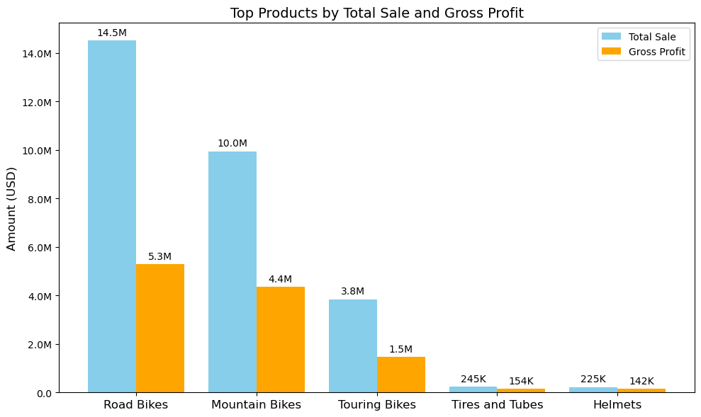
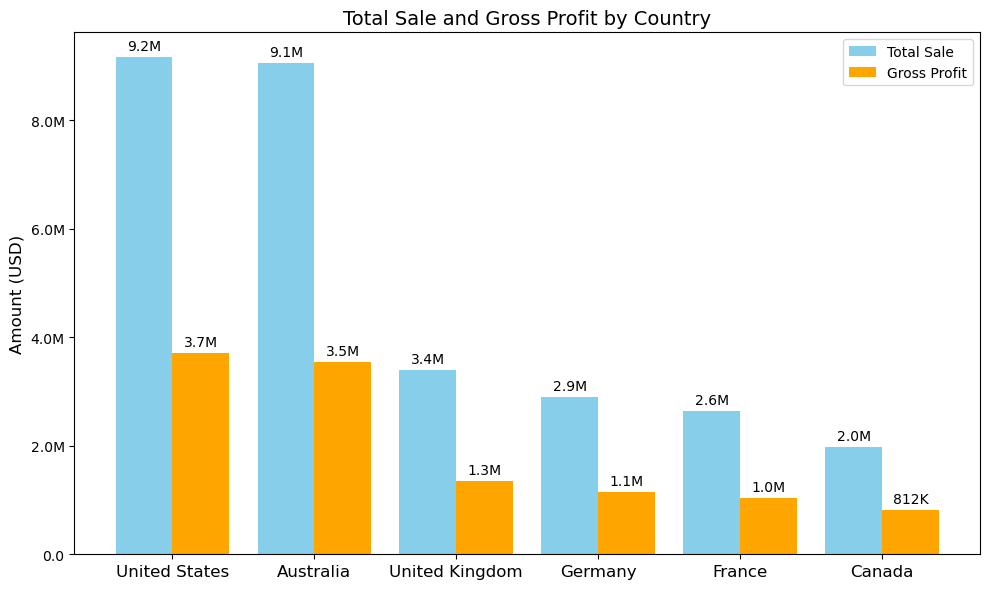
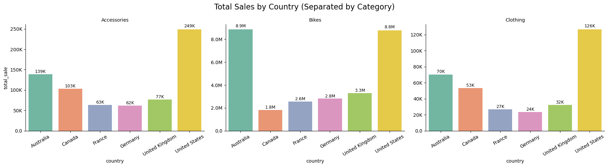
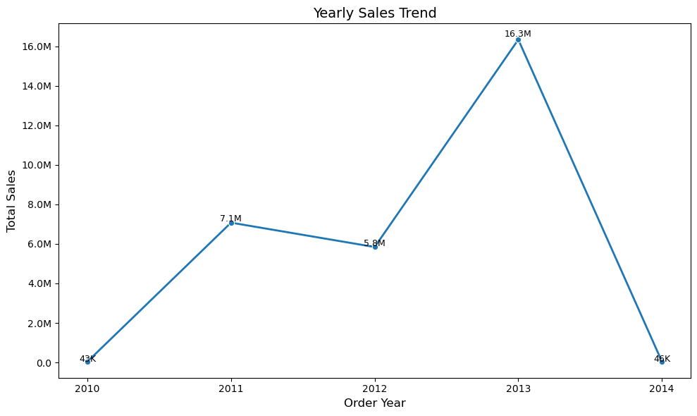
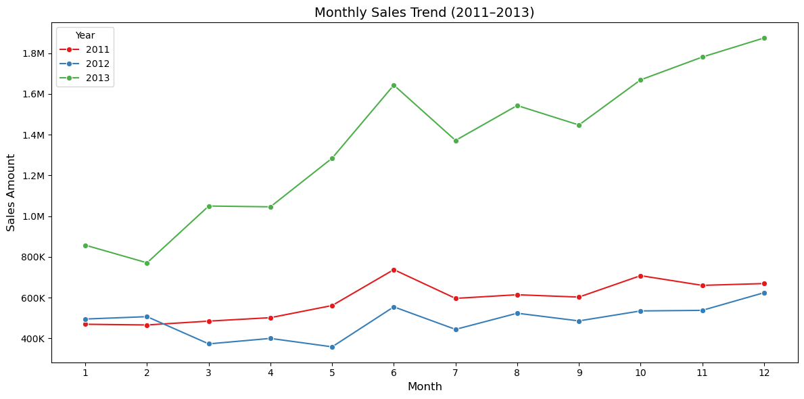

# PedalPro Sales Data Analysis Project

## Project Overview

This project analyzes PedalPro's bicycle and accessories sales data using **Excel, SQL, Python**, and **Power BI** to derive business insights from customer, product, and sales tables. The aim is to clean, transform, visualize, and analyze the data to identify trends, top performers, and regional/customer patterns.

---

## Dataset Overview

### 1. **Customer Table**

- `customer_key`, `customer_id`, `customer_number`, `full_name`, `country`, `marital_status`, `gender`, `birthdate`

### 2. **Product Table**

- `product_key`, `product_id`, `product_number`, `product_name`, `category_id`, `category`, `subcategory`, `maintenance`, `cost`, `product_line`, `start_date`

### 3. **Sales Table**

- `order_number`, `product_key`, `customer_key`, `order_date`, `shipping_date`, `due_date`, `sales_amount`, `quantity`, `price`

---

## 📌 Excel Preprocessing

Initial cleaning and transformation using **Excel**:

- Applied **string functions**, **text-to-column**, **remove duplicates**, and **trim functions**.
- **Filled blank values** to maintain consistency.
- Created **pivot tables** to explore relationships between dimensions and measures like `country`, `category`, and `sales_amount`.

---

## 🛠️ SQL Data Preparation

Used **MySQL** for importing and transforming data:

- Loaded all three tables.
- Data Exploration

  Retrieved:

  - Unique countries
    
  - Distinct product categories/subcategories
    
  - First and last order dates
    

- Performed **JOIN operations** between `sales`, `customer`, and `product` tables.
  
- Created a final **aggregated summary table** combining customer details, product info, and sales facts.

Key SQL Concepts used:

- `CTE`
- `JOINs`
- Date range queries
- Grouping and aggregations

---

## Python Analysis

Performed detailed analysis using **Pandas, Matplotlib, Seaborn**:

### Key Steps:

- Loaded datasets: `sales.csv` and `sale_cust_product.csv`
- Parsed date columns: `order_date`, `shipping_date`, `due_date`
- Created derived columns: `order_year`, `order_month_no`
  
- Converted key categorical columns to `string` type

### KPI Calculations:

- `total_cost = cost_price * quantity`
- `gross_profit = sales_amount - total_cost`

### Analysis Performed:

- **Top Customers**: by total sales and quantity purchased
  ```python
    df_scp.groupby('full_name')[['total_sale']].sum().sort_values('total_sale', ascending=False).head()
  ```
  
- **Top Subcategories**: by total revenue and profit
  ```python
  top_product = df_scp.groupby('subcategory')[['total_sale', 'gross_profit']].sum().sort_values('total_sale', ascending=False).head()
  top_product = top_product.reset_index()
  ```
- **Country-wise Sales**: Identified high-revenue countries
  ```python
  country_sale = df_scp.groupby('country')[['total_sale', 'gross_profit']].agg('sum').sort_values('total_sale', ascending=False)
  country_sale = country_sale.reset_index()
  ```
- **Monthly Trend**: Sales trends by month using `order_month_no`

### Custom Formatter Function:

```python
def formatDollar(x, pos):
    if x >= 1_000_000:
        return f'${x*1e-6:.1f}M'
    elif x >= 1_000:
        return f'${x*1e-3:.1f}K'
    return f'${x:.0f}'
```

Used for formatting currency values on plots.

---

## Visualizations

- **Bar Charts**:

  - Top performing products and subcategories
    
    

  - Country-wise sales and gross profit
    

  - Category wise sales in different countries
    

- **Line Chart**:

  - Yearly sales trend over time
    
  - Monthly sales trend over time
    

Visuals were generated using **Matplotlib** and **Seaborn**, with proper axis formatting and titles.

---

## Insights & Takeaways

- `USA`, `Germany`, and `France` are the top 3 markets by revenue.
- `USA` leads in all 3 categories.
- `Bikes` dominate the sales in all countries.
- `Accessories` and `Mountain Bikes` are top-selling sub categories.
- `2013` was the `peak year` with $16.3M in sales.
- There was `steady growth` from 2010 to 2013.
- A significant drop-off was observed in 2014 because of incomplete data.

---

## Tools Used

| Tool     | Purpose                         |
| -------- | ------------------------------- |
| Excel    | Initial Cleaning & Pivot Tables |
| MySQL    | Data Transformation & Joining   |
| Python   | EDA and KPI Calculations        |
| Power BI | Dashboard and Storytelling      |

---

## Author

**Koustubhya Singh**  
Aspiring Data Analyst | SQL • Excel • Python • Power BI • Tableau  
📧 singh10api@gmail.com  
🔗 [LinkedIn](https://www.linkedin.com/in/koustubhya-singh)

---
